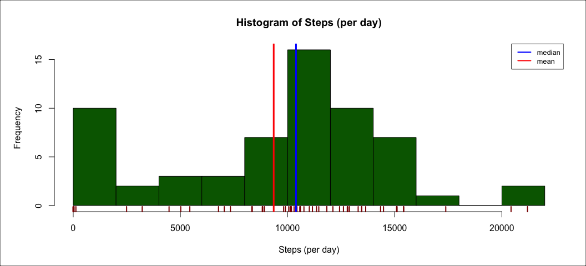
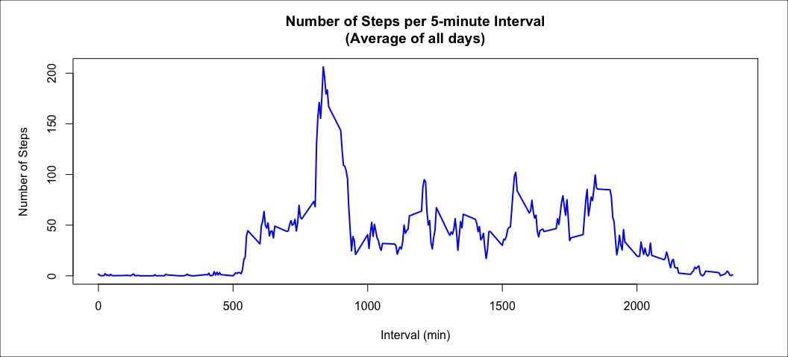
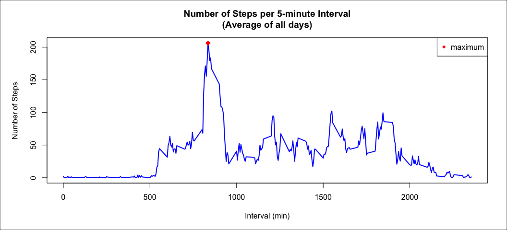
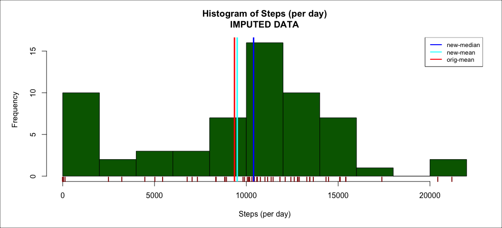
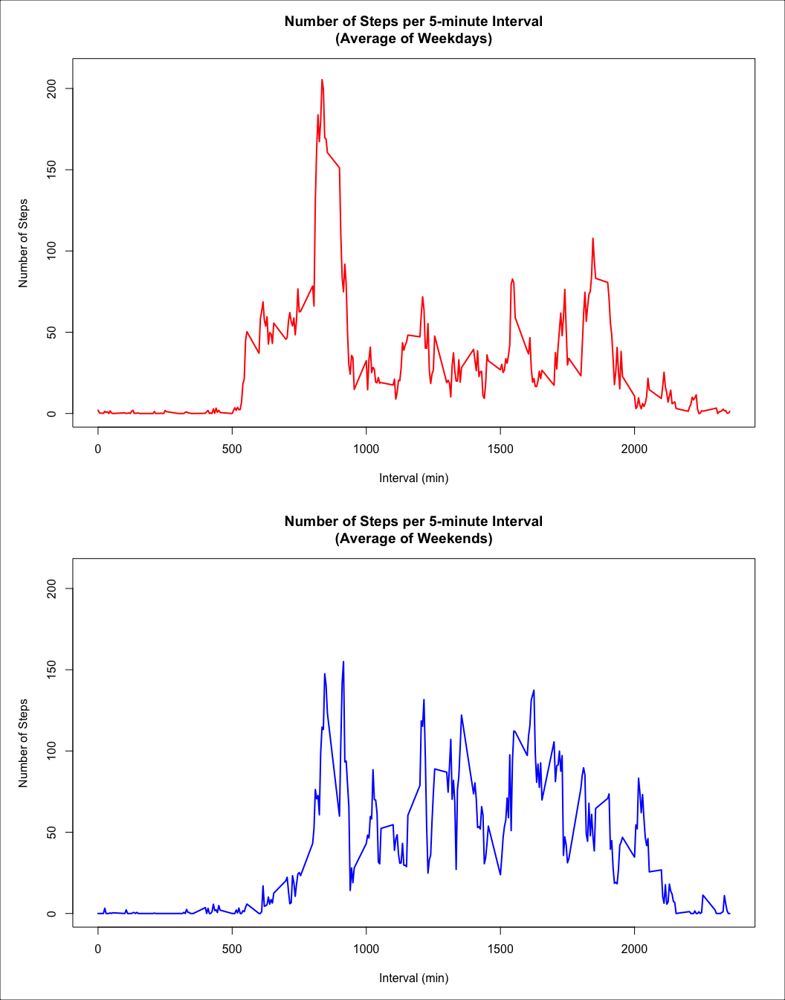

## Loading and preprocessing the data

We will need the `dplyr` library throughout this report, so I loaded that library.


```r
library(dplyr)
```

#### 1. Load the data (i.e. `read.csv()`).

First, I ensured the `data` and `figure` directories were created so that I could extract the zipfile containing the usable data and deposit generated figures into the correct spaces.


```r
if (!dir.exists("data") | !dir.exists("figure")) {
        dir.create("data")
        dir.create("figure")
}
unzip("activity.zip", exdir = "data")

activity <- read.csv("data/activity.csv")
```


#### 2. Process/transform the data (if necessary) into a format suitable for your analysis.


```r
## preview first lines of data
head(activity)
```

```
##   steps       date interval
## 1    NA 2012-10-01        0
## 2    NA 2012-10-01        5
## 3    NA 2012-10-01       10
## 4    NA 2012-10-01       15
## 5    NA 2012-10-01       20
## 6    NA 2012-10-01       25
```

```r
## preview last lines of data
tail(activity)
```

```
##       steps       date interval
## 17563    NA 2012-11-30     2330
## 17564    NA 2012-11-30     2335
## 17565    NA 2012-11-30     2340
## 17566    NA 2012-11-30     2345
## 17567    NA 2012-11-30     2350
## 17568    NA 2012-11-30     2355
```

```r
## check out the structure of the data
str(activity)
```

```
## 'data.frame':	17568 obs. of  3 variables:
##  $ steps   : int  NA NA NA NA NA NA NA NA NA NA ...
##  $ date    : chr  "2012-10-01" "2012-10-01" "2012-10-01" "2012-10-01" ...
##  $ interval: int  0 5 10 15 20 25 30 35 40 45 ...
```

Clearly we need to format the date column to be of class "Date".


```r
activity$date <- as.Date(as.character(activity$date, "%Y%m%d"))
```

The first thing I notice is the fact that our first few values are NAs. In the data summary, we see there are more than 2000 NAs in this set, and they are all contained within the "steps" column.


```r
summary(activity)
```

```
##      steps             date               interval     
##  Min.   :  0.00   Min.   :2012-10-01   Min.   :   0.0  
##  1st Qu.:  0.00   1st Qu.:2012-10-16   1st Qu.: 588.8  
##  Median :  0.00   Median :2012-10-31   Median :1177.5  
##  Mean   : 37.38   Mean   :2012-10-31   Mean   :1177.5  
##  3rd Qu.: 12.00   3rd Qu.:2012-11-15   3rd Qu.:1766.2  
##  Max.   :806.00   Max.   :2012-11-30   Max.   :2355.0  
##  NA's   :2304
```

****

## What is mean total number of steps taken per day?

#### 1. Calculate the total number of steps taken per day.


```r
(daily.total <- activity %>%
        group_by(date) %>%
        summarize(sum = sum(steps, na.rm = TRUE), .groups = "keep"))
```

```
## # A tibble: 61 x 2
## # Groups:   date [61]
##    date         sum
##    <date>     <int>
##  1 2012-10-01     0
##  2 2012-10-02   126
##  3 2012-10-03 11352
##  4 2012-10-04 12116
##  5 2012-10-05 13294
##  6 2012-10-06 15420
##  7 2012-10-07 11015
##  8 2012-10-08     0
##  9 2012-10-09 12811
## 10 2012-10-10  9900
## # … with 51 more rows
```


#### 2. Make a histogram of the total number of steps taken each day.


```r
steps <- daily.total$sum

par(mar = c(5.1, 5.1, 4.1, 2.1))

hist(steps, 
     xlab = "Steps (per day)", 
     main = "Histogram of Steps (per day)", 
     breaks = 10,
     col = "darkgreen")

## optional design parameters
rug(steps, col = "darkred", lwd = 2)
abline(v = median(steps), lwd = 3, col = "blue")
abline(v = mean(steps), lwd = 3, col = "red")
legend("topright", lwd = 2, cex = 0.8, col = c("blue", "red"), legend = c("median", "mean"))
box(which = "outer")
```

<!-- -->

As seen above, the mean is slightly left-skewed due to the presence of a large amount of `NA` values in the data table. 


#### 3. Calculate and report the mean and median of the total number of steps taken per day.

To calculate the values of the mean and median


```r
mean1 <- mean(steps)
median1 <- median(steps)

data.frame(mean = mean1, median = median1)
```

```
##      mean median
## 1 9354.23  10395
```

****

## What is the average daily activity pattern?

To observe the average daily activity pattern, first I grouped each step measurement by their corresponding intervals and then calculated the mean of the steps recorded at that interval each day.


```r
(interval.mean <- activity %>%
        group_by(interval) %>%
        summarize(mean = mean(steps, na.rm = TRUE), .groups = "keep"))
```

```
## # A tibble: 288 x 2
## # Groups:   interval [288]
##    interval   mean
##       <int>  <dbl>
##  1        0 1.72  
##  2        5 0.340 
##  3       10 0.132 
##  4       15 0.151 
##  5       20 0.0755
##  6       25 2.09  
##  7       30 0.528 
##  8       35 0.868 
##  9       40 0     
## 10       45 1.47  
## # … with 278 more rows
```


#### 1. Make a time series plot (i.e. `type = "l"`) of the 5-minute interval (x-axis) and the average number of steps taken, averaged across all days (y-axis)

Next, I produced a scatterplot of the average steps taken against the intervals to observe the change in average over time.


```r
interval.steps <- interval.mean$mean

par(mar = c(5.1, 5.1, 4.1, 2.1))

plot(interval.steps ~ interval,
     data = interval.mean,
     type = "l",
     lwd = 2,
     col = "blue",
     ylab = "Number of Steps",
     xlab = "Interval (min)",
     main = "Number of Steps per 5-minute Interval\n(Average of all days)")
box(which = "outer")
```

<!-- -->


#### 2. Which 5-minute interval, on average across all the days in the dataset, contains the maximum number of steps?

To determine which interval corresponds to the peak between 500 and 1000 min, I utilized the `which.max()` function.


```r
max <- which.max(interval.mean$mean)
max <- interval.mean[max, ]

# confirming the calculation
par(mar = c(5.1, 5.1, 4.1, 2.1))

plot(interval.steps ~ interval,
     data = interval.mean,
     type = "l",
     lwd = 2,
     col = "blue",
     ylab = "Number of Steps",
     xlab = "Interval (min)",
     main = "Number of Steps per 5-minute Interval\n(Average of all days)")
box(which = "outer")

# this should appear at the top of the peak
points(x = max$interval, y = max$mean, pch = 18, col = "red", cex = 1.5)
legend("topright", pch = 18, col = "red", legend = "maximum")
```

<!-- -->

Clearly, the maximum value for the number of steps corresponds to the **835th** interval. The maximum average is **206.1698113 steps**.

****

## Imputing missing values

#### 1. Calculate and report the total number of missing values in the dataset (i.e. the total number of rows with `NAs`).

As reported at the beginning of the report, there are more than 2000 `NA` entries in this data. In fact, there are 2,304 `NA` values according to the chunk below.


```r
sum(is.na(activity$steps))
```

```
## [1] 2304
```

Some of the time, it's not necessary to worry about missing values, as they do not make up a significant chunk of the data. However, in this case, when the percentage of missing values is calculated, more than 13% are missing values.


```r
mean(is.na(activity$steps))
```

```
## [1] 0.1311475
```


#### 2. Devise a strategy for filling in all of the missing values in the dataset. The strategy does not need to be sophisticated. (For example, you could use the mean/median for that day, or the mean for that 5-minute interval, etc.)

When carefully examining the source of missing data, we see that the NAs originate from full-days where steps were not counted.


```r
(missing <- activity %>%
        group_by(date) %>%
        summarize(NAs = sum(is.na(steps)), .groups = "keep") %>%
        filter(NAs > 1))
```

```
## # A tibble: 8 x 2
## # Groups:   date [8]
##   date         NAs
##   <date>     <int>
## 1 2012-10-01   288
## 2 2012-10-08   288
## 3 2012-11-01   288
## 4 2012-11-04   288
## 5 2012-11-09   288
## 6 2012-11-10   288
## 7 2012-11-14   288
## 8 2012-11-30   288
```

Thus, to model this data, I chose to input the median across the time intervals for which data is available.


```r
# generate modeled values by the median of the steps across a given interval
model <- activity %>%
        group_by(interval) %>%
        summarize(modeled = median(steps, na.rm = TRUE), .groups = "keep")

# grab indices of NA values
NA.indeces <- which(is.na(activity$steps))

# use this info to replace with our modeled values
steps.model <- replace(activity$steps, NA.indeces, model$modeled)
```


#### 3. Create a new dataset that is equal to the original dataset but with the missing data filled in.


```r
# create a new data frame with the imputed values
imputed <- activity %>%
  mutate(steps = steps.model)

summary(imputed)
```

```
##      steps          date               interval     
##  Min.   :  0   Min.   :2012-10-01   Min.   :   0.0  
##  1st Qu.:  0   1st Qu.:2012-10-16   1st Qu.: 588.8  
##  Median :  0   Median :2012-10-31   Median :1177.5  
##  Mean   : 33   Mean   :2012-10-31   Mean   :1177.5  
##  3rd Qu.:  8   3rd Qu.:2012-11-15   3rd Qu.:1766.2  
##  Max.   :806   Max.   :2012-11-30   Max.   :2355.0
```

Now the NA values have all been replaced with the modeled step values. Let's see how this has altered the statistical summaries.


```r
# calculate the total number of steps, remove NA values
new.daily.total <- imputed %>%
        group_by(date) %>%
        summarize(sum = sum(steps, na.rm = TRUE), .groups = "keep")

steps2 <- new.daily.total$sum

par(mar = c(5.1, 5.1, 4.1, 2.1))

hist(steps, 
     xlab = "Steps (per day)", 
     main = "Histogram of Steps (per day)\nIMPUTED DATA", 
     breaks = 10,
     col = "darkgreen")

## optional design parameters
rug(steps, col = "darkred", lwd = 2)
abline(v = median(steps2), lwd = 3, col = "blue")
abline(v = mean(steps2), lwd = 3, col = "cyan")
abline(v = mean(steps), lwd = 3, col = "red")
legend("topright", lwd = 2, cex = 0.8, col = c("blue", "cyan", "red"), legend = c("new-median", "new-mean", "orig-mean"))
box(which = "outer")
```

<!-- -->


#### 4-1. Make a histogram of the total number of steps taken each day and Calculate and report the mean and median total number of steps taken per day.


```r
mean2 <- mean(steps2)
median2 <- median(steps2)

data.frame(mean = c(mean1, mean2), median = c(median1, median2), row.names = c("original", "new"))
```

```
##              mean median
## original 9354.230  10395
## new      9503.869  10395
```


#### 4-2. Do these values differ from the estimates from the first part of the assignment? What is the impact of imputing missing data on the estimates of the total daily number of steps?

By replacing the missing values at any given interval with that interval's median, only the mean of the imputed data is affected. Since the weighted mean is calculated and `NA` values removed are counted as zeros, the replacement of the `NAs` with some non-zero values increased the mean of the data set.

****

## Are there differences in activity patterns between weekdays and weekends?

#### 1. Create a new factor variable in the dataset with two levels – “weekday” and “weekend” indicating whether a given date is a weekday or weekend day.

```r
imputed$dayofweek <- weekdays(imputed$date)
weekend <- grepl("Saturday|Sunday", imputed$dayofweek)

for (i in seq_along(weekend)) {
        if (weekend[i] == FALSE) {
                imputed$dayofweek[i] <- "weekday"
        } else {
                imputed$dayofweek[i] <- "weekend"
        }
}
```


#### 2. Make a panel plot containing a time series plot (i.e. `type = "l"`) of the **5-minute interval (x-axis)** and the average number of steps taken, **averaged across all weekday days or weekend days (y-axis)**.


```r
imputed.week <- imputed %>%
        group_by(dayofweek, interval) %>%
        summarize(mean = mean(steps), .groups = "keep")

weekday <- filter(imputed.week, dayofweek == "weekday")
weekend <- filter(imputed.week, dayofweek == "weekend")

par(mfrow = c(2,1), mar = c(5.1, 5.1, 4.1, 2.1))

plot(mean ~ interval,
     data = weekday, 
     type = "l",
     lwd = 2,
     col = "red",
     ylab = "Number of Steps",
     xlab = "Interval (min)",
     main = "Number of Steps per 5-minute Interval\n(Average of Weekdays)",
     ylim = c(0, 210))
plot(mean ~ interval,
     data = weekend, 
     type = "l", 
     lwd = 2,
     col = "blue",
     ylab = "Number of Steps",
     xlab = "Interval (min)",
     main = "Number of Steps per 5-minute Interval\n(Average of Weekends)",
     ylim = c(0, 210))
box(which = c("outer"))
```

<!-- -->

It is quite clear that the distribution of steps throughout the **weekend** appears to be more uniform throughout the intervals. That is, the peaks of the plot are relatively similar in height. Comparatively, the **weekday** peaks appear to spike in the morning and then rise/fall in chunks throughout the day. This may be related to a typical day in an office or university setting where the user is stationary for many moments throughout the day.
